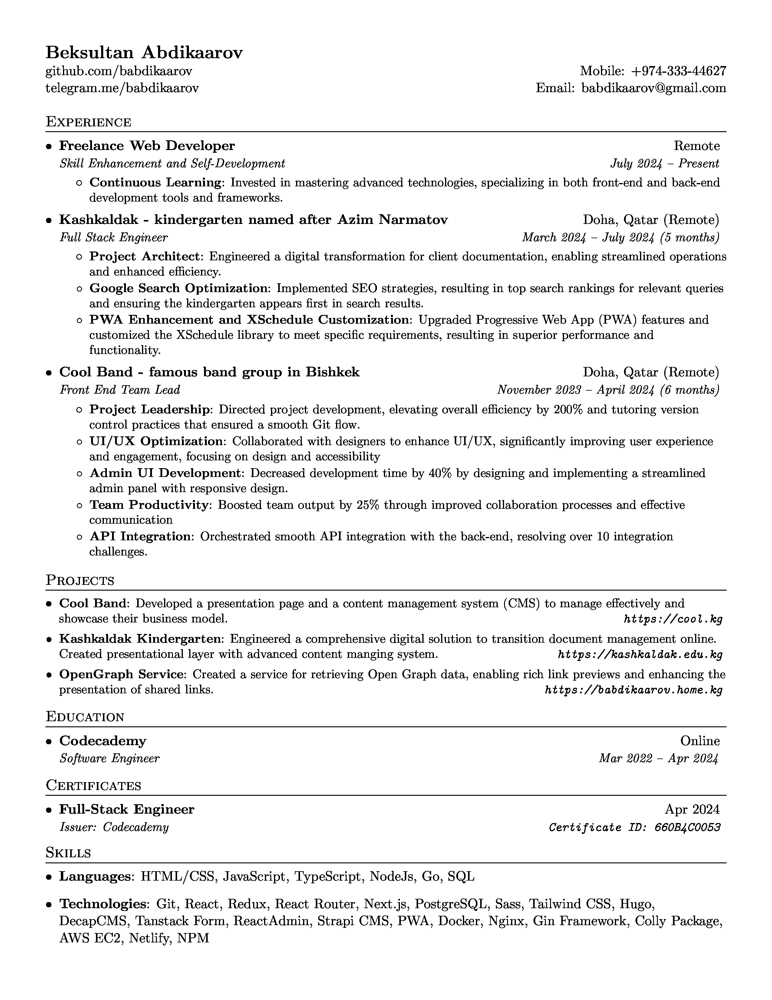

# CV Maker using LaTeX

## Sample



This repository contains a simple and efficient CV generator built using LaTeX. The primary purpose of this project is to enable users to create professional and aesthetically pleasing CVs with minimal effort.

## Features

-  **Customizable Templates**: Easily modify the LaTeX templates to suit your style and preferences.
-  **Automatic Formatting**: Ensures that your CV is neatly formatted and well-organized.
-  **PDF Output**: Generates high-quality PDF documents suitable for printing and digital sharing.

## Prerequisites

To use this CV maker, you'll need to have the following installed on your system:

-  Docker (for containerized builds)

## Getting Started

### Clone the Repository

```bash
git clone https://github.com/babdikaarov/cv.git
cd cv
```

### Build the Docker Image

```bash
docker build -t babdikaarov/latex .
```

### Generate Your CV

Place your LaTeX files in the `/data` directory. Then, run the following command:

```bash

if ls *.tex 1> /dev/null 2>&1; then
  docker run --rm -i -v "$PWD":/data babdikaarov/latex /bin/bash -c \
    'for file in *.tex; do \
      base=$(basename "$file" .tex); \
      pdflatex "$file"; \
      convert -density 300 "$base.pdf" -quality 100 "$base.jpg"; \
    done'
else
  echo "No .tex files found in the current directory."
fi

```
This command will generate a PDF version of your CV.

### Git hub actions

choose the triger strategy

```yml
on:
   workflow_dispatch:
   # push:
   #    branches: [main]
   # pull_request:
   #    branches: [main]
```


## License

This project is licensed under the MIT License.

